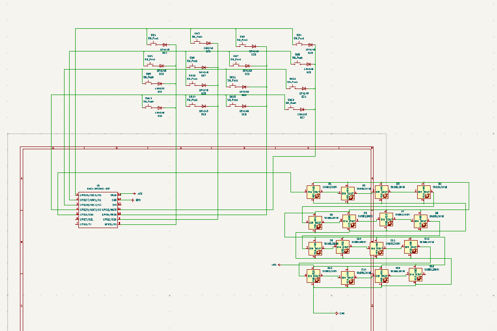

# RGB Keypad – Highway HackPad Project

This is my first ever HackPad for **"Highway"**, a project by Hack Club!

This project is a custom-built **4x4 mechanical keypad** featuring **MX switches**, per-key **RGB lighting** with **SK6812-E Mini LEDs**, and powered by a **Seeed XIAO RP2040** running **KMK firmware**. It's designed to be compact, programmable, and visually striking—perfect for learning firmware development and hardware design.

---

## Project Overview

### Hackpad Overview
This is an overview of the complete Hackpad project, including schematic, PCB, and layout:

---

### Schematic
The keypad uses a 4x4 matrix with 1N4148 diodes to prevent ghosting. The LEDs are chained together and controlled via GPIO10 on the RP2040.

---

### PCB Layout
Compact layout for both the keys and SK6812 LEDs. The board includes breakout pins for +5V, GND, and GPIO lines used in the matrix.

---

### Case & Assembly
The case is designed to fit tightly around the PCB, supporting the keys and exposing the RGB lighting. The XIAO is accessible from the back for flashing.

---

## Bill of Materials (BOM)

| Qty | Component               | Description                            | Part Number / Source       |
|-----|--------------------------|----------------------------------------|-----------------------------|
| 1   | Seeed XIAO RP2040        | Microcontroller board                  | [Link](https://www.seeedstudio.com/XIAO-RP2040-p-5026.html) |
| 16  | Cherry MX Switch         | Mechanical keyboard switches           | Any MX-compatible supplier |
| 16  | 1N4148 Diode             | For switch matrix                      | Standard diode              |
| 16  | SK6812-E Mini            | Individually addressable RGB LED       | Digikey / AliExpress        |
| 1   | Custom PCB               | Designed in KiCad                      | JLCPCB / OSHpark etc.       |
| 1   | 3D-printed case          | PLA or PETG                           | Self-printed or online      |
| 1   | USB-C cable              | For power and programming              | Standard USB-C              |
| —   | Headers / Wires          | For connecting MCU                     | Female headers or soldered  |

---

## Firmware

The firmware is written using [KMK Firmware](https://github.com/KMKfw/kmk_firmware), a powerful Python-based keyboard firmware.  
Each key is mapped in a 4x4 matrix and controls a matching RGB LED.  
See the `main.py` file for the implementation.

---

## Future Improvements

- Add layered key support
- Include OLED or rotary encoder
- Smoother Case

---

## License

This project is open-source under the MIT License.
